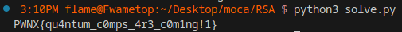

+++
title = 'RSA W Leak'
date = 2023-01-15T09:00:00-07:00
draft = false
tags = ['mocactf24', 'challenge', 'lattices', 'crypto']
+++
 
Like the name implies, this is a normal RSA with leak challenge: 
we are given a standard RSA public key, ciphertext and a leak
$$ \text{leak} = \lfloor2^{8192}(\frac{r_0}{\phi(N)} + \frac{r_1}{N}) \rfloor$$
with $r_0$ and $r_1$ random integers.

```python3
from Crypto.Util.number import getStrongPrime
import secrets
from mpmath import mp, mpf

p = getStrongPrime(1024)
q = getStrongPrime(1024)
n = p*q
e = 65537

phi = (p-1)*(q-1)
d = pow(e, -1, phi)

mp.dps = 8192
leak = mpf(secrets.randbelow(n)) / mpf(phi) 
leak += mpf(secrets.randbelow(n)) / mpf(n)
leak *= 2**8192

flag = open('flag.txt').read().strip()
assert len(flag) == 32
flag = int.from_bytes(flag.encode(), 'big')
ct = pow(flag, e, n)

print(f"n = {n}")
print(f"ct = {ct}")
print(f"leak = {int(leak)}")
```

## The Solve

If we multiply the leak by $N$ we have
$$ 2^{8192}(\frac{r_0 N}{\phi(N)} + r_1) $$

Since $r_1$ is an integer we can get rid of it by considering the leak modulo $2^{8192}$
$$ 2^{8192}(\frac{r_0 N}{\phi(N)} + r_1) = $$
$$ 2^{8192}\frac{r_0 N}{\phi(N)} + 2^{8192}r_1 = $$
$$ 2^{8192}\frac{r_0 N}{\phi(N)} \bmod 2^{8192}$$
rewriting $r_0 = r_a\phi(N) + r_b$
$$ 2^{8192}(r_a + \frac{r_b}{\phi(N)}) = $$
$$2^{8192}\frac{r_b}{\phi(N)} \bmod 2^{8192}$$
If we express this as
$$\phi(N)(\text{leak\_dec}) -r_b(2^{8192}) \approx 0$$
*mmhh... this looks... latticy...*
\
\
We can construct a lattice out of the following matrix
$$ \begin{bmatrix}2^{8192} & 0\\\text{leak\_dec} & 1\end{bmatrix} $$

and we will find that the shortest vector will be
$$ v_s = \begin{bmatrix}\phi(N)(\text{leak\_dec}) \bmod 2^{8192} & \phi(N)\end{bmatrix} $$

Welp, we have $\phi(N)$, we can calculate the private key ($d$, $N$) and decrypt as usual.
```python3
from Crypto.Util.number import inverse, long_to_bytes
from sage.all import matrix, ZZ
from sage.modules.free_module_integer import IntegerLattice

n = 2799674666...
ct = 2105216850...
leak = 8035403848...
e = 0x10001

leak_dec = (leak * n) % 2**8192

m = [
    [2**8192, 0],
    [leak_dec, 1]
]
m = matrix(ZZ, m)
L = IntegerLattice(m).shortest_vector()
fi = L[1]

assert pow(2, fi, n) == 1

d = inverse(e, fi)
flag = pow(ct, d, n)
print(long_to_bytes(flag).decode())
```

